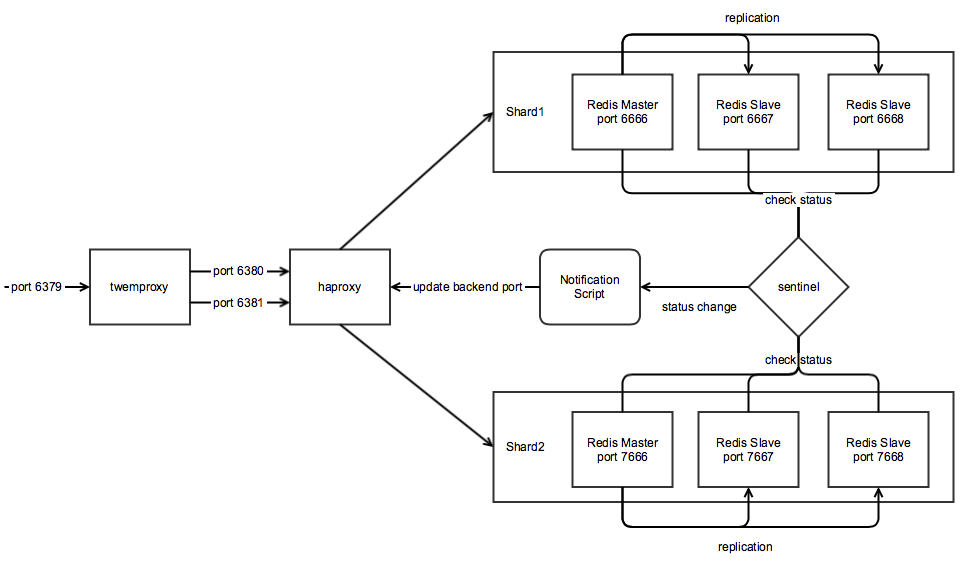

# Sharding Redis HA - twemproxy + sentinel

- twemproxy: sharding
- sentinel: autoswitch master/slave



### Fallover
```
  1) A is master, B is slave
  2) A crashes, sentinel detected and then mark A as failed
  3) sentinal elect B as new master
  4) sentinel execute notification.js and this will update B as new endpoint in twemproxy staging config
  5) twemproxy notice the new config. It restart itself to reload config
  6) twemproxy point to B
```

### Install
```
./install.sh
```

### Install Services
```
./installServices.sh
```

### Run Services
```
service redis_s1_1 start
service redis_s1_2 start
service redis_s1_3 start

service redis_s2_1 start
service redis_s2_2 start
service redis_s2_3 start

service redis_sentinel start
service nutcracker start
```

### Stop Services
```
service nutcracker stop
service redis_sentinel stop

service redis_s1_1 stop
service redis_s1_2 stop
service redis_s1_3 stop

service redis_s2_1 stop
service redis_s2_2 stop
service redis_s2_3 stop
```

### Manual Run (not using service)
```
./run.sh
```

### Manual Stop (not using service)
```
./killall.sh
```

### Load Test Data
```
./loadData.sh
```

### Verify Test Data
```
./checkData.sh
```

### Check Redis Status
```
./checkStatus.sh
```

Check Redis Output:
```
Redis sentinel running :
	127.0.0.1 26379 : YES
6379 port running :
	127.0.0.1 6379 : YES
Shard 1 master running :
	127.0.0.1 6668 : YES
Shard 1 slaves running :
	127.0.0.1 6667 : YES
	127.0.0.1 6666 : YES
Shard 2 master :
	127.0.0.1 7666 : YES
Shard 2 slaves running :
	127.0.0.1 7667 : YES
	127.0.0.1 7668 : YES
```

### Test (not using service)
To prevent conflict, please stop all services before running this script.
```
./test.sh
```

Test Result :
```
Kill all related processes
Reload configs
Remove old data
Start the stack
Data loaded
Test case 1 : kill the master node of shard 1 (127.0.0.1 6666): .....
New master is 127.0.0.1 6667
Redis OK (1000 items all existed)

Test case 2 : kill the master node of shard 2 (127.0.0.1 7666): .....
New master is 127.0.0.1 7667
Redis OK (1000 items all existed)

Test case 3 : kill the master nodes of shard 1 & 2 (127.0.0.1 6667, 127.0.0.1 7667):
New master of shard 1 is 127.0.0.1 6668
New master of shard 2 is 127.0.0.1 7668
Redis OK (1000 items all existed)

Test case 4 : kill flour redis instances (two instances [one master, one slave] in each shard) (127.0.0.1 6668, 127.0.0.1 6666, 127.0.0.1 7668, 127.0.0.1 7666):
New master of shard 1 is 127.0.0.1 6666
New master of shard 2 is 127.0.0.1 7666
Redis OK (1000 items all existed)
```

### Benchmark with pipelining (twemproxy)
```
redis-benchmark -q -t set,get,incr,lpush,lpop,sadd,spop,lpush,lrange -c 100, -P 16
SET: 99009.90 requests per second
GET: 156250.00 requests per second
INCR: 99009.90 requests per second
LPUSH: 96153.84 requests per second
LPOP: 98039.22 requests per second
SADD: 144927.55 requests per second
SPOP: 169491.53 requests per second
LPUSH (needed to benchmark LRANGE): 95238.10 requests per second
LRANGE_100 (first 100 elements): 30211.48 requests per second
LRANGE_300 (first 300 elements): 10822.51 requests per second
LRANGE_500 (first 450 elements): 7027.41 requests per second
LRANGE_600 (first 600 elements): 5089.06 requests per second
```

### Benchmark with pipelining (Redis)
```
redis-benchmark -q -t set,get,incr,lpush,lpop,sadd,spop,lpush,lrange -c 100, -P 16, -p 6666
SET: 147058.81 requests per second
GET: 526315.81 requests per second
INCR: 161290.33 requests per second
LPUSH: 153846.16 requests per second
LPOP: 169491.53 requests per second
SADD: 500000.00 requests per second
SPOP: 555555.56 requests per second
LPUSH (needed to benchmark LRANGE): 151515.16 requests per second
LRANGE_100 (first 100 elements): 60975.61 requests per second
LRANGE_300 (first 300 elements): 13986.01 requests per second
LRANGE_500 (first 450 elements): 8525.15 requests per second
LRANGE_600 (first 600 elements): 6184.29 requests per second
```

```
redis-benchmark -q -t set,get,incr,lpush,lpop,sadd,spop,lpush,lrange -c 100, -P 16, -p 7666
SET: 142857.14 requests per second
GET: 500000.00 requests per second
INCR: 166666.67 requests per second
LPUSH: 156250.00 requests per second
LPOP: 175438.59 requests per second
SADD: 500000.00 requests per second
SPOP: 555555.56 requests per second
LPUSH (needed to benchmark LRANGE): 156250.00 requests per second
LRANGE_100 (first 100 elements): 62111.80 requests per second
LRANGE_300 (first 300 elements): 13227.51 requests per second
LRANGE_500 (first 450 elements): 8223.68 requests per second
LRANGE_600 (first 600 elements): 6281.41 requests per second
```

### Limitation and Assumption
1) Not all Redis commands are supported, please refer to the below reference.
https://github.com/twitter/twemproxy/blob/master/notes/redis.md

2) It took 4-5 seconds for fallover in each shard.

### Notice
tested on
- redis 2.8.17
- twemproxy 0.4.1
