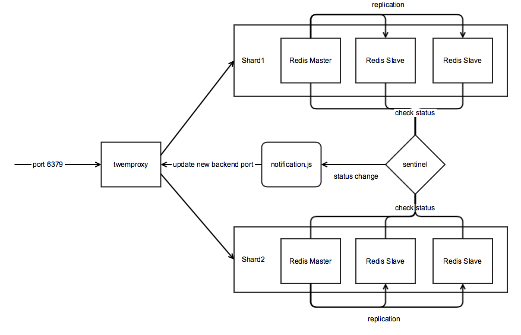

# Sharding Redis HA - twemproxy + sentinel + haproxy

- twemproxy: sharding
- sentinel: autoswitch master/slave
- haproxy: active check for only master node
- haproxy api: disable failed nodes to prevent multimaster



fallover
```
  1) A is master, B is slave
  2) A crashes, sentinel mark A as failed
  3) sentinel execute notification.sh and this notify haproxy to disable A
  4) haproxy disable A
  5) sentinal elect B as new master
  6) sentinel execute notification.sh and this notify haproxy to replace A to B
  7) haproxy enable B
  8) haproxy points only to B
```

### Install
```
./install.sh
```

### Run
```
./run.sh
```

### Test
```
./test.sh
```

### Test Results (output of ./test.sh)
```
Kill all related processes
Reload configs
Remove old data
Start the stack
Data loaded
Test case 1 : kill the master node of shard 1 (127.0.0.1 6666): .....
New master is 127.0.0.1 6668
Redis OK (1000 items all existed)

Test case 2 : kill the master node of shard 2 (127.0.0.1 7666): .....
New master is 127.0.0.1 7668
Redis OK (1000 items all existed)

Test case 3 : kill the master nodes of shard 1 & 2 (127.0.0.1 6668, 127.0.0.1 7668):
New master of shard 1 is 127.0.0.1 6667
New master of shard 2 is 127.0.0.1 7667
Redis OK (1000 items all existed)

Test case 4 : kill flour redis instances (two instances [one master, one slave] in each shard) (127.0.0.1 6667, 127.0.0.1 6668, 127.0.0.1 7667, 127.0.0.1 7668):
New master of shard 1 is 127.0.0.1 6666
New master of shard 2 is 127.0.0.1 7666
Redis OK (1000 items all existed)
```

### Benchmark with pipelining (twemproxy + haproxy)
```
redis-benchmark -q -t set,get,incr,lpush,lpop,sadd,spop,lpush,lrange -c 100, -P 16
SET: 70422.53 requests per second
GET: 140845.06 requests per second
INCR: 87719.30 requests per second
LPUSH: 89285.71 requests per second
LPOP: 90909.09 requests per second
SADD: 161290.33 requests per second
SPOP: 169491.53 requests per second
LPUSH (needed to benchmark LRANGE): 86956.52 requests per second
LRANGE_100 (first 100 elements): 29761.90 requests per second
LRANGE_300 (first 300 elements): 10152.28 requests per second
LRANGE_500 (first 450 elements): 6523.16 requests per second
LRANGE_600 (first 600 elements): 4899.56 requests per second
```

### Benchmark with pipelining (haproxy)
```
redis-benchmark -q -t set,get,incr,lpush,lpop,sadd,spop,lpush,lrange -c 100, -P 16, -p 6380
SET: 126582.27 requests per second
GET: 217391.30 requests per second
INCR: 131578.95 requests per second
LPUSH: 126582.27 requests per second
LPOP: 135135.14 requests per second
SADD: 322580.66 requests per second
SPOP: 357142.84 requests per second
LPUSH (needed to benchmark LRANGE): 125000.00 requests per second
LRANGE_100 (first 100 elements): 56497.18 requests per second
LRANGE_300 (first 300 elements): 12674.27 requests per second
LRANGE_500 (first 450 elements): 7293.95 requests per second
LRANGE_600 (first 600 elements): 4295.53 requests per second
```

```
redis-benchmark -q -t set,get,incr,lpush,lpop,sadd,spop,lpush,lrange -c 100, -P 16, -p 6381
SET: 121951.22 requests per second
GET: 285714.28 requests per second
INCR: 135135.14 requests per second
LPUSH: 99009.90 requests per second
LPOP: 135135.14 requests per second
SADD: 312500.00 requests per second
SPOP: 344827.59 requests per second
LPUSH (needed to benchmark LRANGE): 128205.12 requests per second
LRANGE_100 (first 100 elements): 59523.81 requests per second
LRANGE_300 (first 300 elements): 13123.36 requests per second
LRANGE_500 (first 450 elements): 7968.13 requests per second
LRANGE_600 (first 600 elements): 5571.03 requests per second
```

### Benchmark with pipelining (Redis)
```
redis-benchmark -q -t set,get,incr,lpush,lpop,sadd,spop,lpush,lrange -c 100, -P 16, -p 6666
SET: 142857.14 requests per second
GET: 526315.81 requests per second
INCR: 158730.16 requests per second
LPUSH: 151515.16 requests per second
LPOP: 161290.33 requests per second
SADD: 476190.47 requests per second
SPOP: 500000.00 requests per second
LPUSH (needed to benchmark LRANGE): 151515.16 requests per second
LRANGE_100 (first 100 elements): 61728.39 requests per second
LRANGE_300 (first 300 elements): 13123.36 requests per second
LRANGE_500 (first 450 elements): 8382.23 requests per second
LRANGE_600 (first 600 elements): 6079.03 requests per second
```

```
redis-benchmark -q -t set,get,incr,lpush,lpop,sadd,spop,lpush,lrange -c 100, -P 16, -p 7666
SET: 147058.81 requests per second
GET: 434782.59 requests per second
INCR: 163934.42 requests per second
LPUSH: 156250.00 requests per second
LPOP: 163934.42 requests per second
SADD: 476190.47 requests per second
SPOP: 588235.25 requests per second
LPUSH (needed to benchmark LRANGE): 151515.16 requests per second
LRANGE_100 (first 100 elements): 58479.53 requests per second
LRANGE_300 (first 300 elements): 12970.17 requests per second
LRANGE_500 (first 450 elements): 8605.85 requests per second
LRANGE_600 (first 600 elements): 5980.86 requests per second
```

### Limitation and Assumption
1) Not all Redis commands are supported, please refer to the below reference.
https://github.com/twitter/twemproxy/blob/master/notes/redis.md

2) It took 4-5 seconds for fallover in each shard.

### Notice
tested on
- redis 2.8.17
- haproxy 1.5.8
- twemproxy 0.4.1
